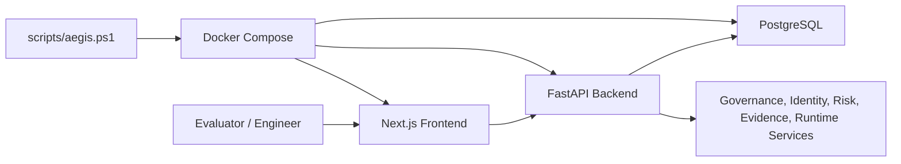

# Architecture Overview

## System Shape

AEGIS OS V3 is a Docker Compose delivered enterprise AI governance platform.

## Runtime Components

| Component | Implementation | Purpose |
| --- | --- | --- |
| Frontend | Next.js | Browser UI, login, workspaces, dashboards, governance workflows. |
| Backend | FastAPI | API, auth, RBAC, governance services, evidence, runtime health. |
| Database | PostgreSQL | Durable platform data. |
| Bootstrap | PowerShell + Docker Compose | Environment validation, service orchestration, health verification. |
| Verification | `scripts/omega3.ps1` | Platform, build, deployment, and security evidence. |

## Configuration Architecture

Configuration is externalized through `.env`, `.env.example`, and `config/env/*.example`. The backend uses a typed Pydantic settings layer and validates environment names, ports, database URL shape, public API URL shape, JWT secret length, and production placeholder secrets before runtime.
